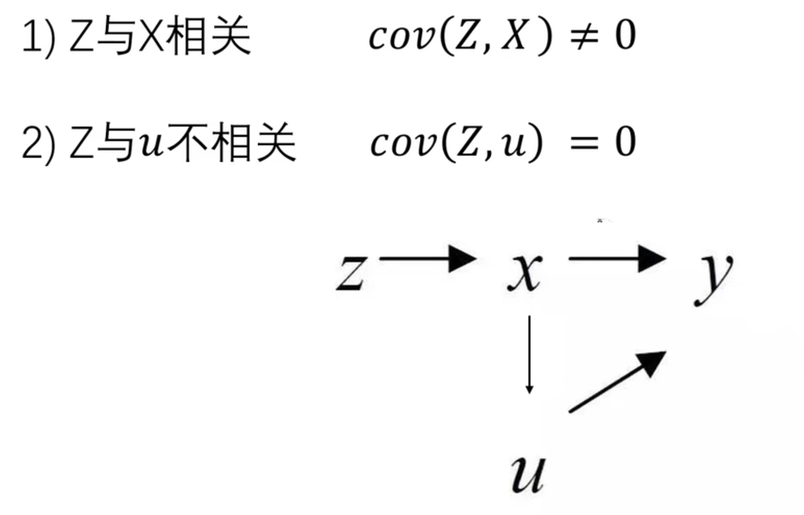

# 内生性问题

## ⚠️ 本质与定义
- **核心问题**：在回归模型 $Y = \beta_0 + \beta_1 X_1 + \cdots + \beta_k X_k + \varepsilon$ 中，若 $\text{Cov}(X_k, \varepsilon) \neq 0$，则解释变量 $X_k$ 具有内生性。  
- 导致OLS估计量丧失**无偏性**和**一致性**，即不能应用OLS方法，例如iv和did等方法都是为了解决内生性问题而产生的。  

## 🔍 四大来源与案例

### 1. 遗漏变量（Omitted Variable Bias）
- **机制**：遗漏同时影响 $Y$ 和 $X$ 的变量 $Z$，使 $Z$ 进入误差项 $\varepsilon$ → $\text{Cov}(X, \varepsilon) \neq 0$  
- **案例**：  
  > 研究教育年限 ($X$) 对收入 ($Y$) 的影响时，若遗漏“个人能力”，则教育回报率被高估（能力高者教育年限更长且收入更高）。

### 2. 双向因果（Reverse Causality）
- **机制**：$X$ 与 $Y$ 互为因果 → $X$ 的变化部分由 $Y$ 驱动  
- **案例**：  
  > 警力配置 ($X$) 与犯罪率 ($Y$)：警力增加可降低犯罪率，但高犯罪率地区也会增配警力。

### 3. 测量误差（Measurement Error）
- **机制**：$X$ 的观测值 $X^* = X + u$（$u$ 为测量误差），若 $\text{Cov}(X, u) \neq 0$ → $\text{Cov}(X^*, \varepsilon) \neq 0$  
- **影响**：系数估计值**偏向零**（衰减偏误）  
- **案例**：  
  > 用问卷调查的健康状况数据预测医疗支出时，主观报告误差导致健康效应被低估。

### 4. 样本选择偏差（Sample Selection Bias）
- **机制**：样本非随机缺失 → 观测样本无法代表总体  
- **案例**：  
  > 仅用上市公司数据研究企业创新（忽略倒闭企业）→ 高估研发投入回报（“幸存者偏差”）。

## ⚖️ 内生性的严重后果
| **问题类型**       | **影响**                                                                 |
|--------------------|--------------------------------------------------------------------------|
| 估计量非一致性      | OLS估计值 $\hat{\beta}$ 偏离真实 $\beta$，样本量增大也无法修正              |
| 因果推断失效        | 误判 $X$ 对 $Y$ 的影响方向（如正效应估为负效应）                             |
| 政策建议失真        | 基于有偏估计的政策可能无效（如误判最低工资对就业的影响）                     |

## 🛠️ 解决方法对比
| **方法**               | **适用场景**                                                                 | **局限性**                                |
|------------------------|-----------------------------------------------------------------------------|------------------------------------------|
| **工具变量法 (IV)**     | 解决遗漏变量、双向因果                                                        | 工具变量难寻（需强相关性+严格外生性）       |
| **固定效应模型 (FE)**   | 面板数据中控制个体/时间不变因素（如企业固有特质）                              | 无法消除时变遗漏变量                      |
| **双重差分法 (DID)**     | 政策评估（处理组 vs. 对照组，政策前 vs. 政策后）                              | 依赖平行趋势假设                          |
| **倾向得分匹配 (PSM)**   | 非随机实验下的选择偏差（匹配处理组与相似对照组）                               | 匹配质量依赖可观测变量                    |
| **Heckman两步法**      | 样本选择偏差（如仅观测到就业者的工资）                                         | 依赖误差项正态分布假设                    |

# iv——工具性变量方法

**参照文献，找到工具变量**

举例，天气作为工具变量，探究孩子看电视时间和自闭症之间的关系。因为天气下雨会使得大家看电视时间变长而与自闭症无关。

举例，用地理位置作为工具变量来探究学区竞争与教育质量的关系，因为地理位置（如附近河流数量）较为随机，与学区数量有关而和教育质量无关。

# fe——固定效应模型

## 🧩 核心思想
通过**控制个体或时间层面不随时间变化的特征**（如地区文化、企业基因、个人天赋等），消除部分因遗漏变量（当这个遗漏变量不随时间变化）导致的内生性问题，同时如果我们研究的是不随时间变化的变量，固定效应模型也是不能应用的。模型设定：
$$
Y_{it} = \alpha_i + \lambda_t + \beta X_{it} + \varepsilon_{it}
$$
- $\alpha_i$：个体固定效应（控制个体间不可观测的**时不变差异**）  
- $\lambda_t$：时间固定效应（控制所有个体共同面临的**时间趋势冲击**）  
- $X_{it}$：随时间变化的解释变量

## 🔧 模型估计方法
### 1. 组内变换法（Within Estimator）
**操作**：对每个个体计算变量**时间维度上的离差值**  
  $$
  (Y_{it} - \bar{Y}_i) = \beta (X_{it} - \bar{X}_i) + (\varepsilon_{it} - \bar{\varepsilon}_i)
  $$
**特点**：由于$\alpha_i$本身不随时间变化，消除个体效应 $\alpha_i$，仅利用个体内部变异识别 $\beta$

### 2. LSDV法（最小二乘虚拟变量）
**操作**：为每个个体设置虚拟变量（如 $D_i = 1$ if 个体$i$）  
  $$
  Y_{it} = \sum_{i=1}^N \alpha_i D_i + \lambda_t + \beta X_{it} + \varepsilon_{it}
  $$
**局限**：个体数量大时计算效率低（N>1000时优先用组内法）

在应用过程中，可以先对所有数据进行固定效应的离差变换，从而分离那些与时间无关的无用变量。然后再用工具变量法进行分析。