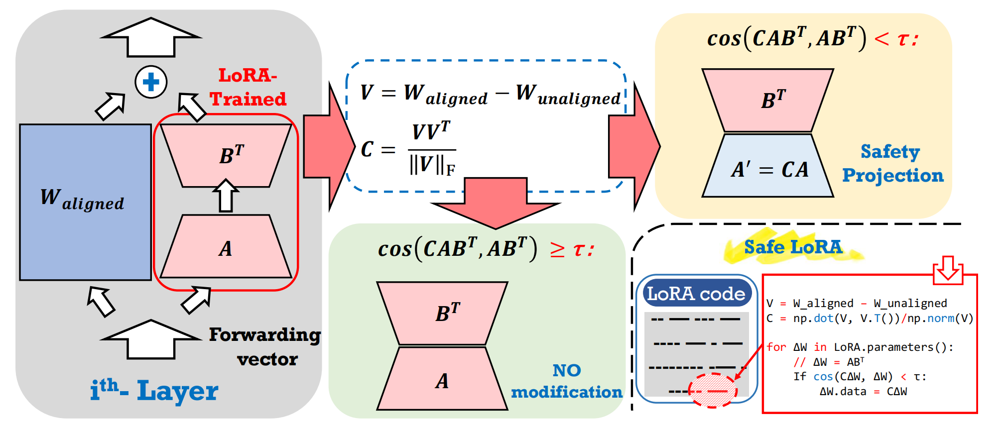

论文分享——Safe LoRA: the Silver Lining of Reducing Safety Risks when Fine-tuning Large Language Models

目前有很多论文开始考虑，模型的对齐和其参数本身变化的关系，可以认为模型的对齐就是将llm参数在参数空间中向安全的空间进行移动。Safe LoRA, which can introduce the
projection of LoRA weights from selected layers to the safety-aligned subspace,
effectively reducing the safety risks in LLM fine-tuning while maintaining utility.


## Safe LoRA 概览

### 1. 背景与目标
- 在 LoRA 微调过程中，防止权重更新偏离已对齐模型的方向。
- 通过「安全投影」机制，确保更新后的权重仍与“对齐权重”保持一致。

### 2. 关键符号
| 符号 | 含义 |
| --- | --- |
| `W_unaligned` | 未对齐（base）模型权重 |
| `W_aligned` | 已对齐（chat）模型权重 |
| `V` | 对齐差异矩阵，`V = W_aligned - W_unaligned` |
| `C` | 投影算子，`C = V Vᵀ / ‖V‖_F` |
| `ABᵀ` | LoRA 更新权重 `ΔW` |
| `CABᵀ` | 投影后的 LoRA 权重 |
| `T` | 余弦相似度阈值 |

### 3. 流程步骤
1. **获取对齐矩阵**  
   \[
   V = W_{\text{aligned}} - W_{\text{unaligned}}
   \]
   例：`Llama-2-7b-base` → `Llama-2-7b-chat`

2. **计算投影算子**  
   \[
   C = \frac{V V^\top}{\|V\|_F}
   \]

3. **逐层检查与修正**  
   对每层 LoRA 更新 `ΔW = ABᵀ`：  
   - 计算余弦相似度 `cos(CABᵀ, ABᵀ)`  
   - 若 `cos < T`，将 `ABᵀ` 替换为 `CABᵀ`（安全修正）  
   - 若 `cos ≥ T`，保留原始 `ABᵀ`

### 4. 伪代码
```python
# 计算对齐矩阵
V = W_aligned - W_unaligned

# 计算投影算子
C = np.dot(V, V.T) / np.linalg.norm(V, 'fro')

# 遍历 LoRA 参数
for w in lora_parameters:
    ΔW = w  # ABᵀ
    if cosine_similarity(C @ ΔW, ΔW) < T:
        w.data = C @ ΔW  # 安全修正

我们认为V是安全相关向量，让base模型在微调基础上根据安全相关向量的方向进行微调。

## 近似投影矩阵：从 `C` 到 `C̃`

### 1. 问题背景
- 原始投影方法（第 β.3 节）虽能消除微调带来的安全风险，但每层都要计算逆矩阵 `(VᵀV)⁻¹`，耗时严重。
- 为此，提出近似版本 `C̃`：

\[
\tilde{C}_i = \frac{V_i V_i^{\top}}{\|V_i\|_F}
\]

其中 `\|·\|_F` 表示 Frobenius 范数。

In this paper, we propose Safe LoRA to address the safety alignment
issues caused by fine-tuning LLMs, without making any assumptions about the user’s intentions,
whether benign or malicious.